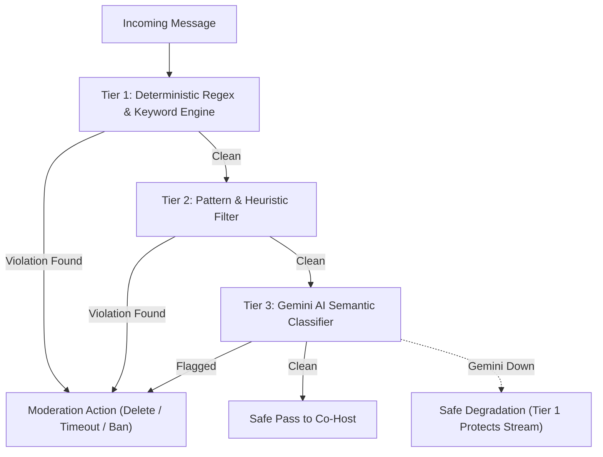

# GODDESS AI 2.0 — AI Moderation 2.0 Guide

## 1. 3-Tier Moderation Architecture

GODDESS AI 2.0 deploys a tiered defense model for YouTube Live chat moderation:

### Tier 1: Deterministic Regex Rules
- Catches hate speech, severe harassment, scam domains, invite spam, and banned regex patterns in $< 1\text{ms}$.
- Operates independently of external API providers.
- **100% operational during complete Gemini outages**.

### Tier 2: Heuristic Analysis
- Detects repetitive flooding, character stretching, caps spam, and multi-line emotes.

### Tier 3: Gemini AI Semantic Classifier
- Analyzes context, subtle toxicity, self-harm risks, and covert harassment.
- Employs structured output classification with confidence score.

---

## 2. Safety Gates & Emergency Controls
- Emergency Stop immediately halts automated bans and timeouts.
- Safe Mode switches moderation to `LOG` only (dry-run).
- Operators can configure per-stream sensitivity and override any AI decision.
