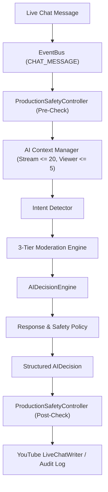

# GODDESS AI 2.0 — Production AI Intelligence Architecture

## 1. Executive Summary

The Production AI Intelligence layer in GODDESS AI 2.0 coordinates live YouTube moderation and interactive AI Co-Host intelligence across up to 4 simultaneous live streams.

Core Invariant:
$$\text{SAFE STOP} > \text{UNSAFE AUTOMATION}$$

If AI providers (Gemini) are unavailable, overloaded, or unconfigured, the system **fails closed**:
- AI Co-Host returns `NO_RESPONSE` without fabricating synthetic replies.
- AI Moderation gracefully falls back to 100% operational Tier-1 deterministic regex rules.
- Operational actions are halted if safety gates or emergency stop are active.

---

## 2. Centralized AI Decision Pipeline

---

## 3. Decision Model Structure

Every evaluated message produces a structured, auditable `AIDecision`:
- `decision_id`: Unique identifier
- `stream_id`: Isolated stream slot (`STREAM_A`..`STREAM_D`)
- `message_id`: Source YouTube message ID
- `action`: `COHOST_REPLY`, `COHOST_DRY_RUN`, `MODERATE_DELETE`, `MODERATE_TIMEOUT`, `MODERATE_BAN`, `SAFE_PASS`, `FAIL_CLOSED`
- `confidence`: Confidence score ($0.0 \to 1.0$)
- `reason`: Auditable human-readable decision rationale
- `priority`: `HIGH` (Moderation) or `NORMAL` (Co-Host)
- `should_reply`: Boolean indicator for outgoing chat execution
- `should_moderate`: Boolean indicator for moderation actions
