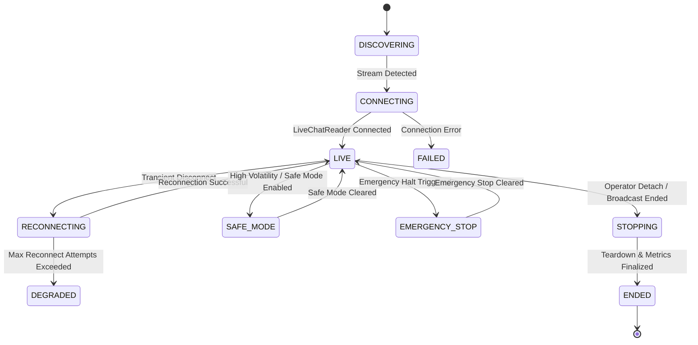

# GODDESS AI 2.0 — Production Live Operations Guide

## Overview

GODDESS AI 2.0 provides an autonomous live operations engine capable of supervising up to 4 simultaneous YouTube Live streams (`STREAM_A`, `STREAM_B`, `STREAM_C`, `STREAM_D`) with strict per-stream isolation, centralized safety gating, automatic stream discovery, resilient reconnection, and creator control center integration.

---

## Core Safety Invariant

$$\text{SAFE STOP} > \text{UNSAFE AUTOMATION}$$

If dependency health, stream state, authentication credentials, or safety state is uncertain, automated external mutations are halted immediately. Read-only telemetry, safe-mode dry-run evaluation, and manual creator overrides remain functional.

---

## Multi-Stream Lifecycle States

---

## Operational Safety Gating Matrix

| Operation | NORMAL | DEGRADED | SAFE_MODE | EMERGENCY_STOP | SHUTTING_DOWN |
|---|:---:|:---:|:---:|:---:|:---:|
| **Tier-1 Regex Moderation** | Allowed | Allowed | Allowed (Log Only) | Blocked | Blocked |
| **Tier-2/3 Gemini AI Moderation** | Allowed | Tier-1 Fallback | Blocked | Blocked | Blocked |
| **AI Co-Host Reply Generation** | Allowed | Allowed | Blocked | Blocked | Blocked |
| **Live Chat Outgoing Messages** | Allowed | Allowed | Blocked | Blocked | Blocked |
| **Chat Commands Execution** | Allowed | Allowed | Allowed | Blocked | Blocked |
| **Stream Reconnection** | Allowed | Bounded | Bounded | Blocked | Blocked |
| **Dashboard Telemetry / Metrics** | Allowed | Allowed | Allowed | Allowed | Allowed |
