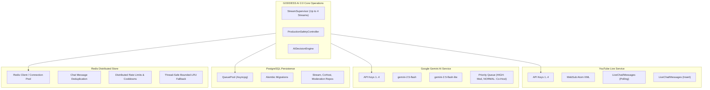

# GODDESS AI 2.0 — Real Service Integration Audit

## 1. Overview & Scope

This document details the real external service integration boundaries for GODDESS AI 2.0:
- **YouTube Data API v3 & YouTube Live Streaming API**
- **Google Gemini AI API (v1 / google-genai)**
- **PostgreSQL 16 Async Engine (asyncpg / SQLAlchemy 2.x)**
- **Redis Distributed State Store (aioredis)**
- **WebSocket Real-Time Gateway**

All real integrations are strictly audited for:
1. Credential isolation and zero raw secret exposure.
2. Controlled execution: real API tests require explicit operator environment opt-in (`RUN_REAL_YOUTUBE_TEST=true`, `RUN_REAL_GEMINI_TEST=true`).
3. Fail-closed safety: $\text{SAFE STOP} > \text{UNSAFE AUTOMATION}$.

---

## 2. Service Integration Boundaries



---

## 3. Boundary Verification & Audit Results

### A. YouTube Integration
- **Key Loading**: Loads up to 4 keys (`YOUTUBE_API_KEY_1`..`4`).
- **Rotation**: 403 quota exhaustion triggers exponential cooldown and rotates to next available key.
- **Fail-Closed**: When all keys exhaust quota, outgoing chat is safely blocked with `CredentialUnavailableError`.
- **Operator Test**: `python backend/app/services/youtube/manual_test.py` (requires `RUN_REAL_YOUTUBE_TEST=true`).

### B. Gemini AI Integration
- **Key Loading**: Loads up to 4 keys (`GEMINI_API_KEY_1`..`4`).
- **Model Routing**: Primary `gemini-2.5-flash`, switches to `gemini-2.5-flash-lite` on 503 / overload.
- **Fail-Closed**: If Gemini is down or all keys exhausted, Co-Host returns `NO_RESPONSE` without fabricating fake replies. Deterministic Tier-1 moderation rules remain 100% operational.
- **Priority**: Moderation requests are queued as `HIGH` priority; Co-Host requests are queued as `NORMAL`.

### C. PostgreSQL Integration
- **Dialect**: Normalized to `postgresql+asyncpg://`.
- **Transaction Safety**: All mutations wrap in scoped async session transactions with automatic rollback on error.
- **Degradation**: If DB is down, operations layer falls back safely to in-memory state without crashing live chat or safety controls.

### D. Redis Distributed State Store
- **Key Namespaces**: Scoped by `stream_id` (e.g. `chat_dedup:{stream_id}:{message_id}`).
- **Degradation**: If Redis connection fails, seamlessly switches to thread-safe bounded `InMemoryFallbackState` ($\le 10,000$ keys).

### E. WebSocket Security Gateway
- **Auth**: Validated JWT token via query parameter or handshake.
- **Flood Control**: Enforces 30 messages/sec per client and 5 concurrent connections per user.
- **Stream Isolation**: Broadcasts filtered strictly to authorized stream subscribers.

---

## 4. Controlled Real-Service Opt-In Guide

```powershell
# For controlled real Gemini verification:
$env:RUN_REAL_GEMINI_TEST="true"
$env:GEMINI_API_KEY_1="your_gemini_api_key"
pytest -v tests/test_real_integrations/test_gemini_integration_audit.py

# For controlled real YouTube verification:
$env:RUN_REAL_YOUTUBE_TEST="true"
$env:YOUTUBE_API_KEY_1="your_youtube_api_key"
$env:TEST_YOUTUBE_STREAM_ID="your_unlisted_stream_id"
python backend/app/services/youtube/manual_test.py
```
