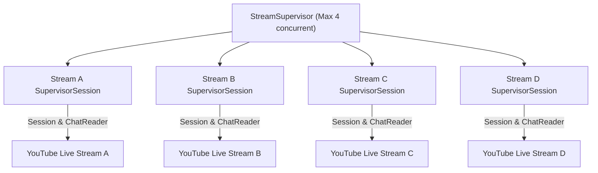

# GODDESS AI 2.0 — Stream Supervisor Architecture

## Overview

The `StreamSupervisor` (`app.services.youtube.stream_supervisor`) orchestrates up to 4 simultaneous YouTube Live streams.

## Features:
- Automatic attach from WebSub live stream discovery.
- Strict isolation: failure on Stream A never crashes or degrades Stream B, C, or D.
- Bounded jittered exponential backoff for reconnects ($1\text{s} \to 2\text{s} \to 4\text{s} \to 8\text{s} \to 16\text{s} \to 30\text{s}$).
- Clean resource deallocation and metric finalization upon broadcast end.
